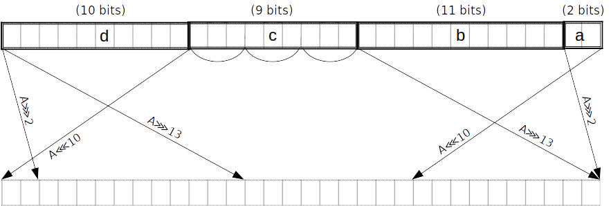

# SHA-256 的 16位表 chip

该 chip 是基于一个16位查找表实现的，电路需要最小 $2^16$ 行，适于整合进一些大的电路中。

我们的目标是使约束的度数最大为9。这让我们能够在同一行内处理进位的约束，以及对一些 $\{0..7\}$ 的小 piece 的约束？？？

## Compression 轮次

总共有64个 compression 轮次。每轮使用8个32位数 $A, B, C, D, E, F, G, H$ 作为输入，然后执行如下操作：

$$
\begin{array}{rcl}
Ch(E, F, G)  &=& (E \wedge F) \oplus (¬E \wedge G) \\
Maj(A, B, C) &=& (A \wedge B) \oplus (A \wedge C) \oplus (B \wedge C) \\
             &=& count(A, B, C) \geq 2 \\
\Sigma_0(A)  &=& (A ⋙ 2) \oplus (A ⋙ 13) \oplus (A ⋙ 22) \\
\Sigma_1(E)  &=& (E ⋙ 6) \oplus (E ⋙ 11) \oplus (E ⋙ 25) \\
H' &=& H + Ch(E, F, G) + \Sigma_1(E) + K_t + W_t \\
E_{new} &=& reduce_6(H' + D) \\
A_{new} &=& reduce_7(H' + Maj(A, B, C) + \Sigma_0(A))
\end{array}
$$

$reduce_i$ 需要处理进位 $0 \leq \mathit{carry} < i$ 的情况。


定义 $\mathtt{spread}$ 为一个16位的输入-输出映射表。不需要另外定义映射表来进行范围约束，可以通过 $\mathtt{spread}$ 实现该功能。

### 模加操作

我们注意到模 $2^32$ 的加法，和先在有限域上做加法，然后通过掩码取出低32位的操作是等价的。例如，有两个操作数 $a$ 和 $b$ ：

$$a \boxplus b = c,$$

我们将操作数分解为16位一个的 chunks ：

$$(a_L : \mathbb{Z}_{2^{16}}, a_H : \mathbb{Z}_{2^{16}}) \boxplus (b_L : \mathbb{Z}_{2^{16}}, b_H : \mathbb{Z}_{2^{16}}) = (c_L : \mathbb{Z}_{2^{16}}, c_H : \mathbb{Z}_{2^{16}}),$$

然后使用有限域的加法重新定义约束：

$$\mathsf{carry} \cdot 2^{32} + c_H \cdot 2^{16} + c_L = (a_H + b_H) \cdot 2^{16} + a_L + b_L.$$

更一般化的，输出可以被分解为任意的比特位组合，而不仅仅是16位一组的 chunks 。注意上述等式已经正确处理了从 $a_L + b_L$ 的进位。

约束要求每个 chunk 都是在正确范围内的，否则之后的赋值会导致有限域上的溢出。

- 操作数和结果的 chunk 可以通过 $\mathtt{spread}$ 约束，具体方法是在表格的某个子集中的 "dense" 列中查找其 chunk 是否存在。我们通过这种方式还能获得输出结果的 "spread" 形式。特别是对于右下的 $\boxplus$ 将变为 $A_new$ ，左下的 $\boxplus$ 变为 $E_{new}$ 。我们在后面对 $Maj$ 和 $Ch$ 的优化中将用到它。

- $\mathsf{carry}$ 必须被约束为操作数数量所允许的进位值的一个精确范围。我们通过 [small range constraint](../../../user/tips-and-tricks.md#small-range-constraints) 来进行约束。

### Maj 函数

$Maj$ 可以通过 $4$ 次查找完成: $2\; \mathtt{spread} * 2$ chunks

- 正如之前提到的，在第一轮之后我们已经有了了 $A$ 的 spread 形式 $A'$ 。类似的， $B$ 和 $C$ 相当于上一轮次中的 $A$ 和 $B$ ，因此在稳态（？？？）中我们也已有了它们的 spread 形式 $B'$ 和 $C'$ 。实际上，我们也可以假设我们在第一轮就有了它们的 spread 形式，要么从 fixed IV??? 或者从上一个块对 $\mathtt{spread}$ 的使用中获取。
- 在域中添加 spread 形式：$M' = A' + B' + C'$
  - 我们可以以 32位计算机字的形式或者以 piece 的形式添加，两者是等价的
- 对于 $i=\{0..1\}$ ，分别计算偶数位 $M_i^{even}$ 和奇数位 $M_i^{odd}$ 。
- 将 $M'$ 约束为 $M' = \mathtt{spread}(M^{even}_0) + 2 \cdot \mathtt{spread}(M^{odd}_0) + 2^{32} \cdot \mathtt{spread}(M^{even}_1) + 2^{33} \cdot \mathtt{spread}(M^{odd}_1)$ ，其中 $M^{odd}_i$ 为 $Maj$ 函数的输出output。

> 注意：“偶数位”指的是 $2$ 的偶数次方的权重，同理，“奇数位”我们指 $2$ 的奇数次方的权重

### Ch 函数
> TODO: can probably be optimized to $4$ or $5$ lookups using an additional table.
>
$Ch$ 可以通过 $8$ 次查找完成： $4\; \mathtt{spread} * 2$ chunks

- 如之前所提到的，在第一轮之后我们已经有了 $E$ 的 spread 形式 $E'$ 。类似的，我们有 $F$ 和 $G$ 和上一轮中的 $E$ 和 $F$ 相等，因此在稳态（？？？）中我们已经有了 $F'$ 和 $G'$ 的 spread 形式。实际上，我们也可以假设我们在第一轮中已经有了它们的 spread 形式，要么从 fixed IV??? 或者从上一个块对 $\mathtt{spread}$ 的使用中获取。
- 计算 $P' = E' + F'$ 和 $Q' = (evens - E') + G'$ ，其中 $evens = \mathtt{spread}(2^{32} - 1)$ 。
  - 我们可以以 32位计算机字的形式或者以 piece 的形式添加，两者是等价的
  - $evens - E'$ 用于计算 $¬E$ 的 spread ，尽管取反操作和 $\mathtt{spread}$ 一般不满足交换律。可以这样计算是因为 $E'$ 中的每个 spread 位都减去了 $1$ ，因此没有借位。
    $\mathtt{spread}$ do not commute in general. It works because each spread bit in $E'$
    is subtracted from $1$, so there are no borrows.
- 计算 $P^{even}_i, P^{odd}_i, Q^{even}_i, Q^{odd}_i$ 使得 $P' = \mathtt{spread}(P^{even}_0) + 2 \cdot \mathtt{spread}(P^{odd}_0) + 2^{32} \cdot \mathtt{spread}(P^{even}_1) + 2^{33} \cdot \mathtt{spread}(P^{odd}_1)$ ，对 $Q'$ 也有类似的计算。
- $\{P^{odd}_i + Q^{odd}_i\}_{i=0..1}$ 即为 $Ch$ 函数的输出。

### Σ_0 函数 

$\Sigma_0(A)$ 可以通过 $6$ 次查找完成。

我们首先将 $A$ 分成长度为 $(2,11,9,10)$ 的 pieces $(a, b,c,d)$ ，以小数端为例。同时我们也取出这些 piece 的 spread 形式。这可以在 PLONK 电路中的两行内完成，因为10位的 piece 和11位的 piece 可以使用 $\mathtt{spread}$ 的查找获得，而9位的 piece 可以被进一步分为3个3位的子 piece 。后者和剩下的2位的 piece 可以通过多项式约束来限制它们的取值范围，每行两个 pieces 。这些小的 piece 的spread 形式可以由插值构成。

注意到将 chunk 划分为 piece 可以和 $A_{new}$ 的规约一起做，即后者不需要额外的查找了。在最后一轮，我们将 $A_{new}$ 在前馈加法（需要最多处理7次进位）做完后进行规约。

$(A ⋙ 2) \oplus (A ⋙ 13) \oplus (A ⋙ 22)$ 等价于 $(A ⋙ 2) \oplus (A ⋙ 13) \oplus (A ⋘ 10)$:



然后，使用 $4$ 个额外的 $\mathtt{spread}$ 查找，我们可以得到结果 $R'$ ，其二进制偶数位是上面 pieces 的一个线性组合。

$$
\begin{array}{rcccccccl}
     &    (a    &||&    d    &||&    c   &||&   b) & \oplus \\
     &    (b    &||&    a    &||&    d   &||&   c) & \oplus \\
     &    (c    &||&    b    &||&    a   &||&   d) & \\
&&&&\Downarrow \\
R' = & 4^{30} a &+& 4^{20} d &+& 4^{11} c &+&   b\;&+ \\
     & 4^{21} b &+& 4^{19} a &+& 4^{ 9} d &+&   c\;&+ \\
     & 4^{23} c &+& 4^{12} b &+& 4^{10} a &+&   d\;&
\end{array}
$$

即，我们计算出压缩后的偶数位 $R^{even}_i$ 和压缩后的奇数位 $R^{odd}_i$ ，并约束

$$R' = \mathtt{spread}(R^{even}_0) + 2 \cdot \mathtt{spread}(R^{odd}_0) + 2^{32} \cdot \mathtt{spread}(R^{even}_1) + 2^{33} \cdot \mathtt{spread}(R^{odd}_1)$$

其中 $\{R^{even}_i\}_{i=0..1}$ 就是 $\Sigma_0$ 函数的输出。

### Σ_1 函数 

$\Sigma_1(E)$ 可以通过 $6$ 次查找完成。

我们首先将 $E$ 分成长度为 $(6,5,14,7)$ 的 pieces $(a, b,c,d)$ ，以小数端为例。同时我们也取出这些 piece 的 spread 形式。这可以在 PLONK 电路中的两行内完成，因为7位的 piece 和14位的 piece 可以使用 $\mathtt{spread}$ 的查找获得，5位的 piece 可以被进一步分为3位3位的子 piece ，6位的 piece 可以被分解为2个3位的 piece 。这4个小的 piece 可以通过多项式约束来限制它们的取值范围，每行两个 pieces 。这些小的 piece 的 spread 形式可以由插值构成。

注意到将 chunk 划分为 piece 可以和 $E_{new}$ 的规约一起做，即后者不需要额外的查找了。在最后一轮，我们将 $E_{new}$ 在前馈加法（需要最多处理7次进位）做完后进行规约。

$(E ⋙ 6) \oplus (E ⋙ 11) \oplus (E ⋙ 25)$ 等价于 $(E ⋙ 6) \oplus (E ⋙ 11) \oplus (E ⋘ 7)$.


然后，使用 $4$ 个额外的 $\mathtt{spread}$ 查找，我们可以得到结果 $R'$ ，其二进制偶数位是上面 pieces 的一个线性组合。

$$
\begin{array}{rcccccccl}
     &    (a    &||&    d    &||&    c   &||&   b) & \oplus \\
     &    (b    &||&    a    &||&    d   &||&   c) & \oplus \\
     &    (c    &||&    b    &||&    a   &||&   d) & \\
&&&&\Downarrow \\
R' = & 4^{26} a &+& 4^{19} d &+& 4^{ 5} c &+&   b\;&+ \\
     & 4^{27} b &+& 4^{21} a &+& 4^{14} d &+&   c\;&+ \\
     & 4^{18} c &+& 4^{13} b &+& 4^{ 7} a &+&   d\;&
\end{array}
$$

即，我们计算出压缩后的偶数位 $R^{even}_i$ 和压缩后的奇数位 $R^{odd}_i$ ，并约束

$R^{odd}_i$, and constrain
$$R' = \mathtt{spread}(R^{even}_0) + 2 \cdot \mathtt{spread}(R^{odd}_0) + 2^{32} \cdot \mathtt{spread}(R^{even}_1) + 2^{33} \cdot \mathtt{spread}(R^{odd}_1)$$

其中 $\{R^{even}_i\}_{i=0..1}$ 就是 $\Sigma_1$ 函数的输出。


## 块分解

对于消息中每一个512位的块 $M \in \{0,1\}^{512}$ 来说，其 $64$ 个 $32$ 位的计算机字可以通过以下方式构造：

- 前 $16$ 个字可以通过将 $M$ 分解为32位的块来获得 $$M = W_0 || W_1 || \cdots || W_{14} || W_{15};$$
- 剩下的 $48$ 个字通过如下公式构造：
$$W_i = \sigma_1(W_{i-2}) \boxplus W_{i-7} \boxplus \sigma_0(W_{i-15}) \boxplus W_{i-16},$$ for $16 \leq i < 64$.

> Note: $W$ 的下表从 $0$ 开始

$$
\begin{array}{ccc}
\sigma_0(X) &=& (X ⋙ 7) \oplus (X ⋙ 18) \oplus (X ≫ 3) \\
\sigma_1(X) &=& (X ⋙ 17) \oplus (X ⋙ 19) \oplus (X ≫ 10) \\
\end{array}
$$

> Note: $≫$ 是右**移位**运算，不是循环，和 $⋙$ 区分 

### σ_0 函数

$(X ⋙ 7) \oplus (X ⋙ 18) \oplus (X ≫ 3)$ 等价于 $(X ⋙ 7) \oplus (X ⋘ 14) \oplus (X ≫ 3)$ 。


和之前类似，也用小数端表示，但 $(a, b, c, d)$ 的长度分别为 $(3, 4, 11, 14)$ 。另外，将 $b$ 分解为两个2位的子 pieces 。

$$
\begin{array}{rcccccccl}
     & (0^{[3]} &||&    d    &||&    c   &||&   b) & \oplus \\
     & (\;\;\;b &||&    a    &||&    d   &||&   c) & \oplus \\
     & (\;\;\;c &||&    b    &||&    a   &||&   d) & \\
&&&&\Downarrow \\
R' = &          & & 4^{15} d &+& 4^{ 4} c &+&   b\;&+ \\
     & 4^{28} b &+& 4^{25} a &+& 4^{11} d &+&   c\;&+ \\
     & 4^{21} c &+& 4^{17} b &+& 4^{14} a &+&   d\;&
\end{array}
$$

### σ_1 function

$(X ⋙ 17) \oplus (X ⋙ 19) \oplus (X ≫ 10)$ is equivalent to
$(X ⋘ 15) \oplus (X ⋘ 13) \oplus (X ≫ 10)$.


TODO: this diagram doesn't match the expression on the right. This is just for consistency
with the other diagrams.

和之前一样用小数端表示， $(a, b, c, d)$ 的长度分别为 $(10, 7, 2, 13)$ 。另外，将 $b$ 分解为 $(3,2,2)$ 位的子 pieces 。

$$
\begin{array}{rcccccccl}
     & (0^{[10]}&||&    d    &||&    c   &||&   b) & \oplus \\
     & (\;\;\;b &||&    a    &||&    d   &||&   c) & \oplus \\
     & (\;\;\;c &||&    b    &||&    a   &||&   d) & \\
&&&&\Downarrow \\
R' = &          & & 4^{ 9} d &+& 4^{ 7} c &+&   b\;&+ \\
     & 4^{25} b &+& 4^{15} a &+& 4^{ 2} d &+&   c\;&+ \\
     & 4^{30} c &+& 4^{23} b &+& 4^{13} a &+&   d\;&
\end{array}
$$

### 消息调度

我们将 $\sigma_0$ 应用于 $W_{1..48}$ ，将 $\sigma_1$ 应用于 $W_{14..61}$ 。为避免重复的应用 $\mathtt{spread}$ ，我们可以将 $W_{14..48}$ 的分解进行合并。合并长度为 $(3,4,11,14)$ 和 $(10,7,2,13)$ 的 pieces 会得到长度分别为 $(3,4,3,7,1,1,13)$ 的 pieces 。


如果我们可以将合并后的分解在3行中完成（单独分解 $\sigma_0$ 和 $\sigma_1$ 需要4行），我们就能节省下35行。

> These might even be doable in $2$ rows; not sure.
> —Daira

我们可以将 $W_{16..61}$ 模 $2^{32}$ 的规约合并至它们在后续计算中的分解时，类似于我们对 $A$ 和 $E$ 做过的操作。

我们仍然需要对 $W_{62..63}$ 进行规约，因为它们没有被分解。（技术上，我们可以暂时不对它们做规约，在后面计算 $A_{new}$ 和 $E_{new}$ 的时候会做规约，但是这会导致我们需要处理多达10次进位，而不是现在的6次，因此还是值得的）。

优化后的调度结果为：
- $2$ 行用来约束 $W_0$ 至 $32$ 比特位
  - 技术上这不是必须的，这里进行约束是保持鲁棒性，因为输入部分的约束是免费的
- $13*2$ 行用来拆分 $W_{1..13}$ 为4个 $(3, 4, 11, 14)$ 比特位的 pieces
- $35*3$ 行用来拆分 $W_{14..48}$ 为 $(3, 4, 3, 7, 1, 1, 13)$ 比特位的 pieces （和 $W_{14..48}$ 的规约进行合并）
- $13*2$ 行用来拆分 $W_{49..61}$ 为 $(10, 7, 2, 13)$ 比特位的 pieces （和规约进行合并）
- $4*48$ 行用来提取 $W_{1..48}$ 的 $\sigma_0$ 计算结果
- $4*48$ 行用来提取 $W_{14..61}$ 的 $\sigma_1$ 计算结果
- $2*2$ 行用来规约 $W_{62..63}$
- $= 547$ rows.

## 总开销

对每一轮次：
- $8$ 行 $Ch$
- $4$ 行 $Maj$
- $6$ 行 $\Sigma_0$
- $6$ 行 $\Sigma_1$
- $reduce_6$ 和 $reduce_7$ 是无开销的
- $= 24$ 每轮行数

这里第三步总计 $24*64 = 1792$ 行，再加上：

- $547$ 行（进行消息调度之后）
- $2*8$ 行给第4步中进行的8次模 $2^32$ 的规约

总共是 $2099$ 行。

## 表格 

我们只需要一个有 $2^{16}$ 行 $3$ 列的 $\mathtt{spread}$ 表。我们需要一个标签列，用以将 $\Sigma_{0..1}$ and $\sigma_{0..1}$ 表格的 $(7, 10, 11, 13, 14)$ 比特位子集挑选出来。

### `spread` 表格

| 行	| 标签| 表格 (16位)      | spread (32位)                     |
|--------------|-----|------------------|----------------------------------|
| $0$          |  0  | 0000000000000000 | 00000000000000000000000000000000 |
| $1$          |  0  | 0000000000000001 | 00000000000000000000000000000001 |
| $2$          |  0  | 0000000000000010 | 00000000000000000000000000000100 |
| $3$          |  0  | 0000000000000011 | 00000000000000000000000000000101 |
| ...          |  0  |       ...        |                ...               |
| $2^{7} - 1$  |  0  | 0000000001111111 | 00000000000000000001010101010101 |
| $2^{7}$      |  1  | 0000000010000000 | 00000000000000000100000000000000 |
| ...          |  1  |       ...        |                ...               |
| $2^{10} - 1$ |  1  | 0000001111111111 | 00000000000001010101010101010101 |
| ...          |  2  |       ...        |                ...               |
| $2^{11} - 1$ |  2  | 0000011111111111 | 00000000010101010101010101010101 |
| ...          |  3  |       ...        |                ...               |
| $2^{13} - 1$ |  3  | 0001111111111111 | 00000001010101010101010101010101 |
| ...          |  4  |       ...        |                ...               |
| $2^{14} - 1$ |  4  | 0011111111111111 | 00000101010101010101010101010101 |
| ...          |  5  |       ...        |                ...               |
| $2^{16} - 1$ |  5  | 1111111111111111 | 01010101010101010101010101010101 |

例如，如果要做一次 $11$ 个比特位的 $\mathtt{spread}$ 查表，我们先对标签进行多项式约束使其必须为 ${0,1,2}$ 。在最常用的 $16$ 位查表中，我们不需要约束标签列。注意我们可以在没有用到的行中（即超过 $2^16$ 的行数）填充任意重复值，例如都填充为全零行。

## 门

### choice 门

从之前操作来的输入：

- $E', F', G',$ 是 32位字 $E, F, G$ 的 $64$ 位 spread 形式，假设服从之前的约束
    - 实际中，我们在分解 $E, F, G$ 为 $16$ 位子 pieces 后能得到 $E', F', G'$ 的 spread 形式
- $evens$ 定义为 $\mathtt{spread}(2^{32} - 1)$
    - $evens_0 = evens_1 = \mathtt{spread}(2^{16} - 1)$

#### E ∧ F
|s_ch|   $a_0$     |    $a_1$    |           $a_2$             |                $a_3$               |                $a_4$               |
|----|-------------|-------------|-----------------------------|------------------------------------|------------------------------------|
|0   |{0,1,2,3,4,5}|$P_0^{even}$ |$\texttt{spread}(P_0^{even})$| $\mathtt{spread}(E^{lo})$          |      $\mathtt{spread}(E^{hi})$     |
|1   |{0,1,2,3,4,5}|$P_0^{odd}$  |$\texttt{spread}(P_0^{odd})$ |$\texttt{spread}(P_1^{odd})$        |                                    |
|0   |{0,1,2,3,4,5}|$P_1^{even}$ |$\texttt{spread}(P_1^{even})$| $\mathtt{spread}(F^{lo})$          |      $\mathtt{spread}(F^{hi})$     |
|0   |{0,1,2,3,4,5}|$P_1^{odd}$  |$\texttt{spread}(P_1^{odd})$ |                                    |                                    |

#### ¬E ∧ G
s_ch_neg|   $a_0$     |    $a_1$    |           $a_2$             |                $a_3$               |                $a_4$               |                $a_5$               |
--------|-------------|-------------|-----------------------------|------------------------------------|------------------------------------|------------------------------------|
    0   |{0,1,2,3,4,5}|$Q_0^{even}$ |$\texttt{spread}(Q_0^{even})$|$\mathtt{spread}(E_{neg}^{lo})$     |   $\mathtt{spread}(E_{neg}^{hi})$  | $\mathtt{spread}(E^{lo})$          |
    1   |{0,1,2,3,4,5}|$Q_0^{odd}$  |$\texttt{spread}(Q_0^{odd})$ |$\texttt{spread}(Q_1^{odd})$        |                                    |      $\mathtt{spread}(E^{hi})$     |
    0   |{0,1,2,3,4,5}|$Q_1^{even}$ |$\texttt{spread}(Q_1^{even})$|$\mathtt{spread}(G^{lo})$           |      $\mathtt{spread}(G^{hi})$     |                                    |
    0   |{0,1,2,3,4,5}|$Q_1^{odd}$  |$\texttt{spread}(Q_1^{odd})$ |                                    |                                    |                                    |

约束：
- `s_ch` (choice): $LHS - RHS = 0$
    - $LHS = a_3 \omega^{-1} + a_3 \omega + 2^{32}(a_4 \omega^{-1} + a_4 \omega)$
    - $RHS = a_2 \omega^{-1} + 2* a_2 + 2^{32}(a_2 \omega + 2* a_3)$
- `s_ch_neg` (negation): 检查 `s_ch` 是否为负数
- 在 $(a_0, a_1, a_2)$ 中查找 $\mathtt{spread}$
- $(a_2, a_3)$ 之间的置换

输出： $Ch(E, F, G) = P^{odd} + Q^{odd} = (P_0^{odd} + Q_0^{odd}) + 2^{16} (P_1^{odd} + Q_1^{odd})$

### Majority 门

从之前操作来的输入：
- 32位字的 $A, B, C$ 的 $64$ 位 spread 形式 $A', B', C',$ ，假设服从之前的约束
    - 实际中，我们在分解 $A, B, C$ 为 $16$ 位子 pieces 后能得到 $A', B', C'$ 的 spread 形式

s_maj|   $a_0$     |   $a_1$    |           $a_2$             |           $a_3$            |           $a_4$          |          $a_5$           |
-----|-------------|------------|-----------------------------|----------------------------|--------------------------|--------------------------|
  0  |{0,1,2,3,4,5}|$M_0^{even}$|$\texttt{spread}(M_0^{even})$|                            |$\mathtt{spread}(A^{lo})$ |$\mathtt{spread}(A^{hi})$ |
  1  |{0,1,2,3,4,5}|$M_0^{odd}$ |$\texttt{spread}(M_0^{odd})$ |$\texttt{spread}(M_1^{odd})$|$\mathtt{spread}(B^{lo})$ |$\mathtt{spread}(B^{hi})$ |
  0  |{0,1,2,3,4,5}|$M_1^{even}$|$\texttt{spread}(M_1^{even})$|                            |$\mathtt{spread}(C^{lo})$ |$\mathtt{spread}(C^{hi})$ |
  0  |{0,1,2,3,4,5}|$M_1^{odd}$ |$\texttt{spread}(M_1^{odd})$ |                            |                          |                          |

约束：
- `s_maj` (majority): $LHS - RHS = 0$
    - $LHS = \mathtt{spread}(M^{even}_0) + 2 \cdot \mathtt{spread}(M^{odd}_0) + 2^{32} \cdot \mathtt{spread}(M^{even}_1) + 2^{33} \cdot \mathtt{spread}(M^{odd}_1)$
    - $RHS = A' + B' + C'$
- 在 $(a_0, a_1, a_2)$ 中查找 $\mathtt{spread}$ 
- $(a_2, a_3)$ 之间的置换

输出： $Maj(A,B,C) = M^{odd} = M_0^{odd} + 2^{16} M_1^{odd}$

### Σ_0 门

$A$ 是一个 32位字，分解为 $(2,11,9,10)$ 位 chunks，从小数端开始。我们将这些 chunks 分别称为 $(a(2), b(11), c(9), d(10))$ ，并且进一步将 $c(9)$ 分解为 3位的 chunks $c(9)^{lo}, c(9)^{mid}, c(9)^{hi}$ 。我们将小 chunks 的 spread 形式写成 witness ：

$$
\begin{array}{ccc}
\Sigma_0(A) &=& (A ⋙ 2) \oplus (A ⋙ 13) \oplus (A ⋙ 22) \\
&=& (A ⋙ 2) \oplus (A ⋙ 13) \oplus (A ⋘ 10)
\end{array}
$$

s_upp_sigma_0|    $a_0$    |   $a_1$    |           $a_2$             |   $a_3$                      |   $a_4$                    |   $a_5$                |   $a_6$                     |
-------------|-------------|------------|-----------------------------|------------------------------|----------------------------|------------------------|-----------------------------|
     0       |{0,1,2,3,4,5}|$R_0^{even}$|$\texttt{spread}(R_0^{even})$|   $c(9)^{lo}$                |$\texttt{spread}(c(9)^{lo})$|   $c(9)^{mid}$         |$\texttt{spread}(c(9)^{mid})$|
     1       |{0,1,2,3,4,5}|$R_0^{odd}$ |$\texttt{spread}(R_0^{odd})$ | $\texttt{spread}(R_1^{odd})$ | $\texttt{spread}(d(10))$   |$\texttt{spread}(b(11))$|         $c(9)$              |
     0       |{0,1,2,3,4,5}|$R_1^{even}$|$\texttt{spread}(R_1^{even})$|   $a(2)$                     |$\texttt{spread}(a(2))$     |   $c(9)^{hi}$          |$\texttt{spread}(c(9)^{hi})$ |
     0       |{0,1,2,3,4,5}|$R_1^{odd}$ |$\texttt{spread}(R_1^{odd})$ |                              |                            |                        |                             |


约束：
- `s_upp_sigma_0` ($\Sigma_0$ 约束): $LHS - RHS + tag + decompose = 0$

$$
\begin{array}{ccc}
tag &=& constrain_1(a_0\omega^{-1}) + constrain_2(a_0\omega) \\
decompose &=& a(2) + 2^2 b(11) + 2^{13} c(9)^{lo} + 2^{16} c(9)^{mid} + 2^{19} c(9)^{hi} + 2^{22} d(10) - A\\
LHS &=& \mathtt{spread}(R^{even}_0) + 2 \cdot \mathtt{spread}(R^{odd}_0) + 2^{32} \cdot \mathtt{spread}(R^{even}_1) + 2^{33} \cdot \mathtt{spread}(R^{odd}_1)
\end{array}
$$
$$
\begin{array}{rcccccccccl}
RHS = & 4^{30} \texttt{spread}(a(2)) &+& 4^{20} \texttt{spread}(d(10)) &+& 4^{17} \texttt{spread}(c(9)^{hi}) &+& 4^{14} \texttt{spread}(c(9)^{mid}) &+& 4^{11} \texttt{spread}(c(9)^{lo})  &+&   \texttt{spread}(b(11))\;&+ \\
     & 4^{21} \texttt{spread}(b(11)) &+& 4^{19} \texttt{spread}(a(2)) &+& 4^{9} \texttt{spread}(d(10)) &+&   4^{6} \texttt{spread}(c(9)^{hi}) &+& 4^{3} \texttt{spread}(c(9)^{mid}) &+& \texttt{spread}(c(9)^{lo}) \;&+ \\
     & 4^{29} \texttt{spread}(c(9)^{hi}) &+& 4^{26} \texttt{spread}(c(9)^{mid}) &+& 4^{23} \texttt{spread}(c(9)^{lo})  &+& 4^{12} \texttt{spread}(b(11)) &+& 4^{10} \texttt{spread}(a(2)) &+&   \texttt{spread}(d(10))\;&
\end{array}
$$

- 在 $a_0, a_1, a_2$ 中查找 $\mathtt{spread}$ 
- $a(2)$ 中的 2比特位范围检查及2比特位 spread 检查
- $c(9)^{lo}, c(9)^{mid}, c(9)^{hi}$ 上的 3比特位范围检查和3比特位 spread 检查

（见 [辅助门](#helper-gates)）

输出： $\Sigma_0(A) = R^{even} = R_0^{even} + 2^{16} R_1^{even}$

### Σ_1 门
$E$ 是一个 32位字，分解为 $(6,5,14,7)$ 位 chunks，从小数端开始。我们将这些 chunks 分别称为 $(a(6), b(5), c(14), d(7))$ ，并且进一步将 $a(6)$ 分解为两个3位的 chunks $a(6)^{lo}, a(6)^{hi}$ ，并更进一步将两个3比特位的chunk $a(6)^{lo}, a(6)^{hi}$ 和 $b$ 分解为 (2,3)比特位的 chunks $b(5)^{lo}, b(5)^{hi}$ 。我们将小 chunks 的 spread 形式写成 witness ：

$$
\begin{array}{ccc}
\Sigma_1(E) &=& (E ⋙ 6) \oplus (E ⋙ 11) \oplus (E ⋙ 25) \\
&=& (E ⋙ 6) \oplus (E ⋙ 11) \oplus (E ⋘ 7)
\end{array}
$$

s_upp_sigma_1|    $a_0$    |   $a_1$    |           $a_2$             |   $a_3$                      |   $a_4$                    |   $a_5$                |   $a_6$                     |   $a_7$    |
-------------|-------------|------------|-----------------------------|------------------------------|----------------------------|------------------------|-----------------------------|------------|
     0       |{0,1,2,3,4,5}|$R_0^{even}$|$\texttt{spread}(R_0^{even})$|   $b(5)^{lo}$                |$\texttt{spread}(b(5)^{lo})$|   $b(5)^{hi}$          |$\texttt{spread}(b(5)^{hi})$ |   $b(5)$   |
     1       |{0,1,2,3,4,5}|$R_0^{odd}$ |$\texttt{spread}(R_0^{odd})$ | $\texttt{spread}(R_1^{odd})$ | $\texttt{spread}(d(7))$    |$\texttt{spread}(c(14))$|                             |            |
     0       |{0,1,2,3,4,5}|$R_1^{even}$|$\texttt{spread}(R_1^{even})$|   $a(6)^{lo}$                |$\texttt{spread}(a(6)^{lo})$|   $a(6)^{hi}$          |$\texttt{spread}(a(6)^{hi})$ |   $a(6)$   |
     0       |{0,1,2,3,4,5}|$R_1^{odd}$ |$\texttt{spread}(R_1^{odd})$ |                              |                            |                        |                             |            |


约束：
- `s_upp_sigma_1` ($\Sigma_1$ constraint): $LHS - RHS + tag + decompose = 0$

$$
\begin{array}{ccc}
tag &=& a_0\omega^{-1} + constrain_4(a_0\omega) \\
decompose &=& a(6)^{lo} + 2^3 a(6)^{hi} + 2^6 b(5)^{lo} + 2^8 b(5)^{hi} + 2^{11} c(14) + 2^{25} d(7) - E \\
LHS &=& \mathtt{spread}(R^{even}_0) + 2 \cdot \mathtt{spread}(R^{odd}_0) + 2^{32} \cdot \mathtt{spread}(R^{even}_1) + 2^{33} \cdot \mathtt{spread}(R^{odd}_1)
\end{array}
$$
$$
\begin{array}{rcccccccccl}
RHS = & 4^{29} \texttt{spread}(a(6)^{hi}) &+& 4^{26} \texttt{spread}(a(6)^{lo}) &+& 4^{19} \texttt{spread}(d(7)) &+& 4^{ 5} \texttt{spread}(c(14)) &+&  4^{2} \texttt{spread}(b(5)^{hi}) &+& \texttt{spread}(b(5)^{lo})\;&+ \\
     & 4^{29} \texttt{spread}(b(5)^{hi}) &+& 4^{27} \texttt{spread}(b(5)^{lo}) &+& 4^{24} \texttt{spread}(a(6)^{hi}) &+& 4^{21} \texttt{spread}(a(6)^{lo}) &+& 4^{14} \texttt{spread}(d(7)) &+&   \texttt{spread}(c(14))\;&+ \\
     & 4^{18} \texttt{spread}(c(14)) &+& 4^{15} \texttt{spread}(b(5)^{hi}) &+& 4^{13} \texttt{spread}(b(5)^{lo}) &+& 4^{10} \texttt{spread}(a(6)^{hi}) &+& 4^{7} \texttt{spread}(a(6)^{lo}) &+&   \texttt{spread}(d(7))\;&
\end{array}
$$

- 在 $a_0, a_1, a_2$ 中查找 $\mathtt{spread}$
- $b(5)^{lo}$ 中的 2比特位范围检查及2比特位 spread 检查
- $a(6)^{lo}, a(6)^{hi}, b(4)^{hi}$ 上的 3比特位范围检查和3比特位 spread 检查

（见[辅助门](#helper-gates)）

输出： $\Sigma_1(E) = R^{even} = R_0^{even} + 2^{16} R_1^{even}$

### σ_0 门
#### v1

$\sigma_0$ 门的v1占一个字，可以分解为 $(3, 4, 11, 14)$ 位的 chunks （已经在消息调度中被约束）。我们将这些 chunks 称为 $(a(3), b(4), c(11), d(14)).$  $b(4)$ 被进一步分解为两个2比特位的 chunks $b(4)^{lo},b(4)^{hi}.$ 我们将小 chunks 的 spread 形式写成 witness 。我们从消息调度中已经获得了 $\texttt{spread}(c(11))$ 和 $\texttt{spread}(d(14))$ 。

$(X ⋙ 7) \oplus (X ⋙ 18) \oplus (X ≫ 3)$ 等价于 $(X ⋙ 7) \oplus (X ⋘ 14) \oplus (X ≫ 3)$ 。

s_low_sigma_0|    $a_0$    |   $a_1$    |            $a_2$            |    $a_3$                    |    $a_4$                   |    $a_5$           |    $a_6$                   |
-------------|-------------|------------|-----------------------------|-----------------------------|----------------------------|--------------------|----------------------------|
      0      |{0,1,2,3,4,5}|$R_0^{even}$|$\texttt{spread}(R_0^{even})$|    $b(4)^{lo}$              |$\texttt{spread}(b(4)^{lo})$|    $b(4)^{hi}$     |$\texttt{spread}(b(4)^{hi})$|
      1      |{0,1,2,3,4,5}|$R_0^{odd}$ |$\texttt{spread}(R_0^{odd})$ |$\texttt{spread}(R_1^{odd})$ |$\texttt{spread}(c)$        |$\texttt{spread}(d)$|      $b(4)$                |
      0      |{0,1,2,3,4,5}|$R_1^{even}$|$\texttt{spread}(R_1^{even})$|    $0$                      |    $0$                     |    $a$             |    $\texttt{spread}(a)$    |
      0      |{0,1,2,3,4,5}|$R_1^{odd}$ |$\texttt{spread}(R_1^{odd})$ |                             |                            |                    |                            |

约束：
- `s_low_sigma_0` ($\sigma_0$ v1 约束): $LHS - RHS = 0$

$$
\begin{array}{ccc}
LHS &=& \mathtt{spread}(R^{even}_0) + 2 \cdot \mathtt{spread}(R^{odd}_0) + 2^{32} \cdot \mathtt{spread}(R^{even}_1) + 2^{33} \cdot \mathtt{spread}(R^{odd}_1)
\end{array}
$$
$$
\begin{array}{rccccccccl}
RHS = &         & & 4^{15} d(14) &+& 4^{ 4} c(11) &+&  4^2 b(4)^{hi} &+&   b(4)^{lo}\;&+ \\
     & 4^{30} b(4)^{hi} &+& 4^{28} b(4)^{lo} &+& 4^{25} a(3) &+& 4^{11} d(14) &+&   c(11)\;&+ \\
     & 4^{21} c(11) &+& 4^{19} b(4)^{hi} &+& 4^{17} b(4)^{lo} &+& 4^{14} a(3) &+&   d(14)\;&
\end{array}
$$

- 检查 `b` 是否被正确的分解为4比特位的一些 pieces
    - $W^{b(4)lo} + 2^2 W^{b(4)hi} - W = 0$
- $b(4)^{lo}, b(4)^{hi}$ 中的 2比特位范围检查及2比特位 spread 检查
- $a(3)$ 上的 3比特位范围检查和3比特位 spread 检查

#### v2
$\sigma_0$ 门的v2占一个字，可以分解为 $(3, 4, 3,7,1,1,13)$ 位的 chunks （已经在消息调度中被约束）。我们将这些 chunks 称为 $(a(3), b(4), c(3), d(7), e(1), f(1), g(13)).$ 我们从消息调度中已经获得了 $\texttt{spread}(d(7))$ 和 $\texttt{spread}(g(13))$ 。1比特位的 $e(1), f(1)$ 在 spread 操作中不做更改，可以直接使用。另外 $b(4)$ 被进一步分解为两个2比特位的 chunks $b(4)^{lo},b(4)^{hi}.$ 我们将小 chunks 的 spread 形式写成 witness 。

$(X ⋙ 7) \oplus (X ⋙ 18) \oplus (X ≫ 3)$ 等价于 $(X ⋙ 7) \oplus (X ⋘ 14) \oplus (X ≫ 3)$ 。

s_low_sigma_0_v2|    $a_0$    |   $a_1$    |           $a_2$             |   $a_3$                     |   $a_4$                    |   $a_5$                |   $a_6$                    |   $a_7$    |
----------------|-------------|------------|-----------------------------|-----------------------------|----------------------------|------------------------|----------------------------|------------|
        0       |{0,1,2,3,4,5}|$R_0^{even}$|$\texttt{spread}(R_0^{even})$|   $b(4)^{lo}$               |$\texttt{spread}(b(4)^{lo})$| $b(4)^{hi}$            |$\texttt{spread}(b(4)^{hi})$|            |
        1       |{0,1,2,3,4,5}|$R_0^{odd}$ |$\texttt{spread}(R_0^{odd})$ | $\texttt{spread}(R_1^{odd})$| $\texttt{spread}(d(7))$    |$\texttt{spread}(g(13))$|       $b(4)$               | $e(1)$     |
        0       |{0,1,2,3,4,5}|$R_1^{even}$|$\texttt{spread}(R_1^{even})$|    $a(3)$                   |$\texttt{spread}(a(3))$     |    $c(3)$              |$\texttt{spread}(c(3))$     | $f(1)$     |
        0       |{0,1,2,3,4,5}|$R_1^{odd}$ |$\texttt{spread}(R_1^{odd})$ |                             |                            |                        |                            |            |

约束：
- `s_low_sigma_0_v2` ($\sigma_0$ v2 约束): $LHS - RHS = 0$

$$
\begin{array}{ccc}
LHS &=& \mathtt{spread}(R^{even}_0) + 2 \cdot \mathtt{spread}(R^{odd}_0) + 2^{32} \cdot \mathtt{spread}(R^{even}_1) + 2^{33} \cdot \mathtt{spread}(R^{odd}_1)
\end{array}
$$
$$
\begin{array}{rcccccccccccl}
RHS = &         & & 4^{16} g(13) &+& 4^{15} f(1) &+& 4^{ 14} e(1) &+& 4^{ 7} d(7) &+& 4^{ 4} c(3) &+&  4^2 b(4)^{hi} &+&   b(4)^{lo}\;&+ \\
     & 4^{30} b(4)^{hi} &+& 4^{28} b(4)^{lo} &+& 4^{25} a(3) &+& 4^{12} g(13) &+& 4^{11} f(1) &+&  4^{10} e(1) &+&   4^{3} d(7) &+&   c(3)\;&+ \\
     & 4^{31} e(1) &+& 4^{24} d(7) &+& 4^{21} c(3) &+& 4^{19} b(4)^{hi} &+& 4^{17} b(4)^{lo} &+& 4^{14} a(3) &+&   4^{1} g(13) &+&   f(1)\;&
\end{array}
$$

- 检查 `b` 是否被正确的分解为4比特位的 pieces
    - $W^{b(4)lo} + 2^2 W^{b(4)hi} - W = 0$
- $b(4)^{lo}, b(4)^{hi}$ 中的 2比特位范围检查及2比特位 spread 检查
- $a(3),c(3)$ 上的 3比特位范围检查和3比特位 spread 检查

### σ_1 门
#### v1
$\sigma_1$ 门的v1占一个字，可以分解为 $(10,7,2,13)$ 位的 chunks （已经在消息调度中被约束）。我们将这些 chunks 称为 $(a(10), b(7), c(2), d(13)).$  $b(7)$ 被进一步分解为 $(2,2,3)$ 比特位的 chunks $b(7)^{lo},b(7)^{mid},b(7)^{hi}.$ 我们将小 chunks 的 spread 形式写成 witness 。我们从消息调度中已经获得了 $\texttt{spread}(a(10))$ 和 $\texttt{spread}(d(13))$ 。

$(X ⋙ 17) \oplus (X ⋙ 19) \oplus (X ≫ 10)$ 等价于 $(X ⋘ 15) \oplus (X ⋘ 13) \oplus (X ≫ 10)$.

s_low_sigma_1|    $a_0$    |   $a_1$    |           $a_2$             |   $a_3$                      |   $a_4$                    |   $a_5$                |   $a_6$                     |
-------------|-------------|------------|-----------------------------|------------------------------|----------------------------|------------------------|-----------------------------|
      0      |{0,1,2,3,4,5}|$R_0^{even}$|$\texttt{spread}(R_0^{even})$|   $b(7)^{lo}$                |$\texttt{spread}(b(7)^{lo})$|   $b(7)^{mid}$         |$\texttt{spread}(b(7)^{mid})$|
      1      |{0,1,2,3,4,5}|$R_0^{odd}$ |$\texttt{spread}(R_0^{odd})$ | $\texttt{spread}(R_1^{odd})$ | $\texttt{spread}(a(10))$   |$\texttt{spread}(d(13))$|     $b(7)$                  |
      0      |{0,1,2,3,4,5}|$R_1^{even}$|$\texttt{spread}(R_1^{even})$|    $c(2)$                    |$\texttt{spread}(c(2))$     |   $b(7)^{hi}$          |$\texttt{spread}(b(7)^{hi})$ |
      0      |{0,1,2,3,4,5}|$R_1^{odd}$ |$\texttt{spread}(R_1^{odd})$ |                              |                            |                        |                             |

约束：
- `s_low_sigma_1` ($\sigma_1$ v1 约束): $LHS - RHS = 0$
$$
\begin{array}{ccc}
LHS &=& \mathtt{spread}(R^{even}_0) + 2 \cdot \mathtt{spread}(R^{odd}_0) + 2^{32} \cdot \mathtt{spread}(R^{even}_1) + 2^{33} \cdot \mathtt{spread}(R^{odd}_1)
\end{array}
$$
$$
\begin{array}{rcccccccccl}
RHS = &          & & 4^{ 9} d(13) &+& 4^{ 7} c(2) &+& 4^{4} b(7)^{hi} &+& 4^{2} b(7)^{mid} &+&   b(7)^{lo}\;&+ \\
     & 4^{29} b(7)^{hi} &+& 4^{27} b(7)^{mid} &+& 4^{25} b(7)^{lo} &+& 4^{15} a(10) &+& 4^{ 2} d(13) &+&   c(2)\;&+ \\
     & 4^{30} c(2) &+& 4^{27} b(7)^{hi} &+& 4^{25} b(7)^{mid} &+& 4^{23} b(7)^{lo} &+& 4^{13} a(10) &+&   d(13)\;&
\end{array}
$$

- 检查 `b` 是否被正确的分解为7比特位的 pieces 。
    - $W^{b(7)lo} + 2^2 W^{b(7)mid} + 2^4 W^{b(7)hi} - W = 0$
- $b(7)^{lo}, b(7)^{mid}, c(2)$ 中的 2比特位范围检查及2比特位 spread 检查
- $b(7)^{hi}$ 上的 3比特位范围检查和3比特位 spread 检查

#### v2
$\sigma_1$ 门的v2占一个字，可以分解为 $(3, 4, 3,7,1,1,13)$ 位的 chunks （已经在消息调度中被约束）。我们将这些 chunks 称为 $(a(3), b(4), c(3), d(7), e(1), f(1), g(13)).$ 我们从消息调度中已经获得了 $\texttt{spread}(d(7))$ 和 $\texttt{spread}(g(13))$ 。1比特位的 $e(1), f(1)$ 在 spread 操作中不做更改，可以直接使用。另外 $b(4)$ 被进一步分解为两个2比特位的 chunks $b(4)^{lo},b(4)^{hi}.$ 我们将小 chunks 的 spread 形式写成 witness 。

$(X ⋙ 17) \oplus (X ⋙ 19) \oplus (X ≫ 10)$ 等价于 $(X ⋘ 15) \oplus (X ⋘ 13) \oplus (X ≫ 10)$ 。

s_low_sigma_1_v2|    $a_0$    |   $a_1$    |           $a_2$             |   $a_3$                     |   $a_4$                    |   $a_5$                 |   $a_6$                    |   $a_7$    |
----------------|-------------|------------|-----------------------------|-----------------------------|----------------------------|-------------------------|----------------------------|------------|
        0       |{0,1,2,3,4,5}|$R_0^{even}$|$\texttt{spread}(R_0^{even})$|   $b(4)^{lo}$               |$\texttt{spread}(b(4)^{lo})$|   $b(4)^{hi}$           |$\texttt{spread}(b(4)^{hi})$|            |
        1       |{0,1,2,3,4,5}|$R_0^{odd}$ |$\texttt{spread}(R_0^{odd})$ | $\texttt{spread}(R_1^{odd})$| $\texttt{spread}(d(7))$    | $\texttt{spread}(g(13))$|       $b(4)$               | $e(1)$     |
        0       |{0,1,2,3,4,5}|$R_1^{even}$|$\texttt{spread}(R_1^{even})$|    $a(3)$                   |$\texttt{spread}(a(3))$     |    $c(3)$               |$\texttt{spread}(c(3))$     | $f(1)$     |
        0       |{0,1,2,3,4,5}|$R_1^{odd}$ |$\texttt{spread}(R_1^{odd})$ |                             |                            |                         |                            |            |

约束：
- `s_low_sigma_1_v2` ($\sigma_1$ v2 constraint): $LHS - RHS = 0$

$$
\begin{array}{ccc}
LHS &=& \mathtt{spread}(R^{even}_0) + 2 \cdot \mathtt{spread}(R^{odd}_0) + 2^{32} \cdot \mathtt{spread}(R^{even}_1) + 2^{33} \cdot \mathtt{spread}(R^{odd}_1)
\end{array}
$$
$$
\begin{array}{rccccccccccccl}
RHS = &        &&&&  & & 4^{ 9} g(13) &+& 4^{ 8} f(1) &+& 4^{ 7} e(1) &+& d(7)\;&+ \\
     & 4^{25} d(7) &+& 4^{22} c(3)  &+& 4^{20} b(4)^{hi}  &+& 4^{18} b(4)^{lo}  &+& 4^{15} a &+& 4^{ 2} g(13) &+&  4^{1}f(1)  &+&   e(1)\;&+ \\
     & 4^{31} f(1) &+& 4^{30} e(1) &+&  4^{23} d(7) &+& 4^{20} c(3)  &+& 4^{18} b(4)^{hi}  &+& 4^{16} b(4)^{lo}  &+& 4^{13} a &+&   g(13)\;&
\end{array}
$$

- 检查 `b` 是否被正确的分解为4比特位的子 pieces
    - $W^{b(4)lo} + 2^2 W^{b(4)hi} - W = 0$
- $b(4)^{lo}, b(4)^{hi}$ 中的 2比特位范围检查及2比特位 spread 检查
- $a(3),c(3)$ 上的 3比特位范围检查和3比特位 spread 检查

### 辅助门

#### 小范围约束
令 $constrain_n(x) = \prod_{i=0}^n (x-i)$. 约束该表达式的值为0，相当于约束了 $x \in [0..n].$

#### 2比特位范围检查
$(a - 3)(a - 2)(a - 1)(a) = 0$

sr2| $a_0$ |
---|-------|
 1 |   a   |

#### 2比特位 spread
$l_1(a) + 4*l_2(a) + 5*l_3(a) - a' = 0$

ss2| $a_0$ | $a_1$
---|-------|------
 1 |   a   |   a'

插值多项式：
- $l_0(a) = \frac{(a - 3)(a - 2)(a - 1)}{(-3)(-2)(-1)}$ ($\mathtt{spread}(00) = 0000$)
- $l_1(a) = \frac{(a - 3)(a - 2)(a)}{(-2)(-1)(1)}$ ($\mathtt{spread}(01) = 0001$)
- $l_2(a) = \frac{(a - 3)(a - 1)(a)}{(-1)(1)(2)}$ ($\mathtt{spread}(10) = 0100$)
- $l_3(a) = \frac{(a - 2)(a - 1)(a)}{(1)(2)(3)}$ ($\mathtt{spread}(11) = 0101$)

#### 3比特位范围检查
$(a - 7)(a - 6)(a - 5)(a - 4)(a - 3)(a - 2)(a - 1)(a) = 0$

sr3| $a_0$ |
---|-------|
 1 |   a   |

#### 3比特位 spread
$l_1(a) + 4*l_2(a) + 5*l_3(a) + 16*l_4(a) + 17*l_5(a) + 20*l_6(a) + 21*l_7(a) - a' = 0$

ss3| $a_0$ | $a_1$
---|-------|------
 1 |   a   |   a'

插值多项式：
- $l_0(a) = \frac{(a - 7)(a - 6)(a - 5)(a - 4)(a - 3)(a - 2)(a - 1)}{(-7)(-6)(-5)(-4)(-3)(-2)(-1)}$ ($\mathtt{spread}(000) = 000000$)
- $l_1(a) = \frac{(a - 7)(a - 6)(a - 5)(a - 4)(a - 3)(a - 2)(a)}{(-6)(-5)(-4)(-3)(-2)(-1)(1)}$ ($\mathtt{spread}(001) = 000001$)
- $l_2(a) = \frac{(a - 7)(a - 6)(a - 5)(a - 4)(a - 3)(a - 1)(a)}{(-5)(-4)(-3)(-2)(-1)(1)(2)}$ ($\mathtt{spread}(010) = 000100$)
- $l_3(a) = \frac{(a - 7)(a - 6)(a - 5)(a - 3)(a - 2)(a - 1)(a)}{(-4)(-3)(-2)(-1)(1)(2)(3)}$ ($\mathtt{spread}(011) = 000101$)
- $l_4(a) = \frac{(a - 7)(a - 6)(a - 5)(a - 3)(a - 2)(a - 1)(a)}{(-3)(-2)(-1)(1)(2)(3)(4)}$ ($\mathtt{spread}(100) = 010000$)
- $l_5(a) = \frac{(a - 7)(a - 6)(a - 4)(a - 3)(a - 2)(a - 1)(a)}{(-2)(-1)(1)(2)(3)(4)(5)}$ ($\mathtt{spread}(101) = 010001$)
- $l_6(a) = \frac{(a - 7)(a - 5)(a - 4)(a - 3)(a - 2)(a - 1)(a)}{(-1)(1)(2)(3)(4)(5)(6)}$ ($\mathtt{spread}(110) = 010100$)
- $l_7(a) = \frac{(a - 6)(a - 5)(a - 4)(a - 3)(a - 2)(a - 1)(a)}{(1)(2)(3)(4)(5)(6)(7)}$ ($\mathtt{spread}(111) = 010101$)

#### reduce_6 门
6元素的 $\pmod{2^{32}}$ 加法

输入：
- $E$
- $\{e_i^{lo}, e_i^{hi}\}_{i=0}^5$
- $carry$

检查： $E = e_0 + e_1 + e_2 + e_3 + e_4 + e_5 \pmod{32}$

假设输入被约束为16个比特位
- 加法门 (sa):
  - $a_0 + a_1 + a_2 + a_3 + a_4 + a_5 + a_6 - a_7 = 0$
- 进位门 (sc):
  - $2^{16} a_6 \omega^{-1} + a_6 + [(a_6 - 5)(a_6 - 4)(a_6 -3)(a_6 - 2)(a_6 - 1)(a_6)] = 0$

sa|sc|  $a_0$   |  $a_1$   |$a_2$     |$a_3$     |$a_4$     |$a_5$     |$a_6$          |$a_7$   |
--|--|----------|----------|----------|----------|----------|----------|---------------|--------|
1 |0 |$e_0^{lo}$|$e_1^{lo}$|$e_2^{lo}$|$e_3^{lo}$|$e_4^{lo}$|$e_5^{lo}$|$-carry*2^{16}$|$E^{lo}$|
1 |1 |$e_0^{hi}$|$e_1^{hi}$|$e_2^{hi}$|$e_3^{hi}$|$e_4^{hi}$|$e_5^{hi}$|$carry$        |$E^{hi}$|

假设输入被约束为16个比特位
- 加法门 (sa):
  - $a_0 \omega^{-1} + a_1 \omega^{-1} + a_2 \omega^{-1} + a_0 + a_1 + a_2 + a_3 \omega^{-1} - a_3 = 0$
- 进位门 (sc):
  - $2^{16} a_3 \omega + a_3 \omega^{-1} = 0$


sa|sc|  $a_0$   |  $a_1$   |$a_2$     |$a_3$          |
--|--|----------|----------|----------|---------------|
0 |0 |$e_0^{lo}$|$e_1^{lo}$|$e_2^{lo}$|$-carry*2^{16}$|
1 |1 |$e_3^{lo}$|$e_4^{lo}$|$e_5^{lo}$|$E^{lo}$       |
0 |0 |$e_0^{hi}$|$e_1^{hi}$|$e_2^{hi}$|$carry$        |
1 |0 |$e_3^{hi}$|$e_4^{hi}$|$e_5^{hi}$|$E^{hi}$       |

#### reduce_7 门
7元素的 $\pmod{2^{32}}$ 加法

输入：
- $E$
- $\{e_i^{lo}, e_i^{hi}\}_{i=0}^6$
- $carry$

检查： $E = e_0 + e_1 + e_2 + e_3 + e_4 + e_5 + e_6 \pmod{32}$

假设输入被约束为16个比特位
- 加法门 (sa):
  - $a_0 + a_1 + a_2 + a_3 + a_4 + a_5 + a_6 + a_7 - a_8 = 0$
- 进位门 (sc):
  - $2^{16} a_7 \omega^{-1} + a_7 + [(a_7 - 6)(a_7 - 5)(a_7 - 4)(a_7 -3)(a_7 - 2)(a_7 - 1)(a_7)] = 0$

sa|sc|  $a_0$   |  $a_1$   |$a_2$     |$a_3$     |$a_4$     |$a_5$     |$a_6$     |$a_7$          |$a_8$   |
--|--|----------|----------|----------|----------|----------|----------|----------|---------------|--------|
1 |0 |$e_0^{lo}$|$e_1^{lo}$|$e_2^{lo}$|$e_3^{lo}$|$e_4^{lo}$|$e_5^{lo}$|$e_6^{lo}$|$-carry*2^{16}$|$E^{lo}$|
1 |1 |$e_0^{hi}$|$e_1^{hi}$|$e_2^{hi}$|$e_3^{hi}$|$e_4^{hi}$|$e_5^{hi}$|$e_6^{hi}$|$carry$        |$E^{hi}$|


### 消息调度区域

对于消息 $M \in \{0,1\}^{512}$ 中的每一个 block ，其64个32位字以如下方式构造：
- 通过将 $M$ 以每32个比特进行划分，得到前16个
$$M = W_0 || W_1 || \cdots || W_{14} || W_{15};$$
- 剩下的48个字使用如下的方式构造：

$$W_i = \sigma_1(W_{i-2}) \boxplus W_{i-7} \boxplus \sigma_0(W_{i-15}) \boxplus W_{i-16},$$ for $16 \leq i < 64$.

sw|sd0|sd1|sd2|sd3|ss0|ss0_v2|ss1|ss1_v2|     $a_0$     |     $a_1$        |             $a_2$                 |    $a_3$                     |    $a_4$                         |    $a_5$                        |         $a_6$                     |         $a_7$          |     $a_8$      |    $a_9$     |
--|---|---|---|---|---|------|---|------|---------------|------------------|-----------------------------------|------------------------------|----------------------------------|---------------------------------|---------------------------------  |------------------------|----------------|--------------|
0 | 1 | 0 | 0 | 0 | 0 | 0    | 0 | 0    | {0,1,2,3,4,5} | $W_{0}^{lo}$     | $\texttt{spread}(W_{0}^{lo})$     | $W_{0}^{lo}$                 | $W_{0}^{hi}$                     |   $W_{0}$                       |$\sigma_0(W_1)^{lo}$               |$\sigma_1(W_{14})^{lo}$ |  $W_{9}^{lo}$  |              |
1 | 0 | 0 | 0 | 0 | 0 | 0    | 0 | 0    | {0,1,2,3,4,5} | $W_{0}^{hi}$     | $\texttt{spread}(W_{0}^{hi})$     |                              |                                  |   $W_{16}$                      |$\sigma_0(W_1)^{hi}$               |$\sigma_1(W_{14})^{hi}$ |  $W_{9}^{hi}$  | $carry_{16}$ |
0 | 1 | 1 | 0 | 0 | 0 | 0    | 0 | 0    | {0,1,2,3,4}   |  $W_{1}^{d(14)}$ | $\texttt{spread}(W_{1}^{d(14)})$  | $W_{1}^{lo}$                 | $W_{1}^{hi}$                     |   $W_{1}$                       |$\sigma_0(W_2)^{lo}$               |$\sigma_1(W_{15})^{lo}$ |  $W_{10}^{lo}$ |              |
1 | 0 | 0 | 0 | 0 | 0 | 0    | 0 | 0    | {0,1,2}       |  $W_{1}^{c(11)}$ | $\texttt{spread}(W_{1}^{c(11)})$  | $W_{1}^{a(3)}$               | $W_{1}^{b(4)}$                   |   $W_{17}$                      |$\sigma_0(W_2)^{hi}$               |$\sigma_1(W_{15})^{hi}$ |  $W_{10}^{hi}$ | $carry_{17}$ |
0 | 0 | 0 | 0 | 0 | 0 | 0    | 0 | 0    | {0,1,2,3,4,5} |  $R_0^{even}$    | $\texttt{spread}(R_0^{even})$     | $W_{1}^{b(4)lo}$             |$\texttt{spread}(W_{1}^{b(4)lo})$ | $W_{1}^{b(4)hi}$                |$\texttt{spread}(W_{1}^{b(4)hi})$  |                        |                |              |
0 | 0 | 0 | 0 | 0 | 1 | 0    | 0 | 0    | {0,1,2,3,4,5} |  $R_1^{odd}$     | $\texttt{spread}(R_0^{odd})$      | $\texttt{spread}(R_1^{odd})$ |$\texttt{spread}(W_{1}^{c(11)})$  |$\texttt{spread}(W_{1}^{d(14)})$ | $W_{1}^{b(4)}$                    |                        |                |              |
0 | 0 | 0 | 0 | 0 | 0 | 0    | 0 | 0    | {0,1,2,3,4,5} |  $R_0^{odd}$     | $\texttt{spread}(R_1^{even})$     |  $0$                         |   $0$                            |    $W_{1}^{a(3)}$               |$\texttt{spread}(W_{1}^{a(3)})$    |                        |                |              |
0 | 0 | 0 | 0 | 0 | 0 | 0    | 0 | 0    | {0,1,2,3,4,5} |  $R_1^{even}$    | $\texttt{spread}(R_1^{odd})$      |    $\sigma_0 v1 R_0$         |    $\sigma_0 v1 R_1$             | $\sigma_0 v1 R_0^{even}$        |  $\sigma_0 v1 R_0^{odd}$          |                        |                |              |
..|...|...|...|...|...|...   |...|...   |      ...      |      ...         |              ...                  |     ...                      |     ...                          |    ...                          |         ...                       |         ...            |      ...       |              |
0 | 0 | 0 | 0 | 0 | 0 | 0    | 0 | 0    | {0,1,2,3}     | $W_{14}^{g(13)}$ | $\texttt{spread}(W_{14}^{g(13)})$ | $W_{14}^{a(3)}$              | $W_{14}^{c(3)}$                  |                                 |                                   |                        |                |              |
0 | 1 | 0 | 1 | 0 | 0 | 0    | 0 | 0    |       0       | $W_{14}^{d(7)}$  | $\texttt{spread}(W_{14}^{d(7)})$  | $W_{14}^{lo}$                | $W_{14}^{hi}$                    |   $W_{14}$                      |$\sigma_0(W_{15})^{lo}$            |$\sigma_1(W_{28})^{lo}$ |  $W_{23}^{lo}$ |              |
1 | 0 | 0 | 0 | 0 | 0 | 0    | 0 | 0    |       0       | $W_{14}^{b(4)}$  | $\texttt{spread}(W_{14}^{b(4)})$  | $W_{14}^{e(1)}$              | $W_{14}^{f(1)}$                  |   $W_{30}$                      |$\sigma_0(W_{15})^{hi}$            |$\sigma_1(W_{28})^{hi}$ |  $W_{23}^{hi}$ |
$carry_{30}$ |
0 | 0 | 0 | 0 | 0 | 0 | 0    | 0 | 0    | {0,1,2,3,4,5} | $R_0^{even}$     | $\texttt{spread}(R_0^{even})$     | $W_{14}^{b(4)lo}$            |$\texttt{spread}(W_{14}^{b(4)lo})$|   $W_{14}^{b(4) hi}$            |$\texttt{spread}(W_{14}^{b(4)hi})$ |                        |                |              |
0 | 0 | 0 | 0 | 0 | 0 | 1    | 0 | 0    | {0,1,2,3,4,5} | $R_0^{odd}$      | $\texttt{spread}(R_0^{odd})$      | $\texttt{spread}(R_1^{odd})$ |$\texttt{spread}(W_{14}^{d(7)})$  |$\texttt{spread}(W_{14}^{g(13)})$| $W_{1}^{b(14)}$                   | $W_{14}^{e(1)}$        |                |              |
0 | 0 | 0 | 0 | 0 | 0 | 0    | 0 | 0    | {0,1,2,3,4,5} | $R_1^{even}$     | $\texttt{spread}(R_1^{even})$     |    $W_{14}^{a(3)}$           |$\texttt{spread}(W_{14}^{a(3)})$  |    $W_{14}^{c(3)}$              |$\texttt{spread}(W_{14}^{c(3)})$   | $W_{14}^{f(1)}$        |                |              |
0 | 0 | 0 | 0 | 0 | 0 | 0    | 0 | 0    | {0,1,2,3,4,5} | $R_1^{odd}$      | $\texttt{spread}(R_1^{odd})$      |  $\sigma_0 v2 R_0$           |  $\sigma_0 v2 R_1$               |$\sigma_0 v2 R_0^{even}$         |$\sigma_0 v2 R_0^{odd}$            |                        |                |              |
0 | 0 | 0 | 0 | 0 | 0 | 0    | 0 | 0    | {0,1,2,3,4,5} | $R_0^{even}$     | $\texttt{spread}(R_0^{even})$     | $W_{14}^{b(4)lo}$            |$\texttt{spread}(W_{14}^{b(4)lo})$|   $W_{14}^{b(4) hi}$            |$\texttt{spread}(W_{14}^{b(4)hi})$ |                        |                |              |
0 | 0 | 0 | 0 | 0 | 0 | 0    | 0 | 1    | {0,1,2,3,4,5} | $R_0^{odd}$      | $\texttt{spread}(R_0^{odd})$      | $\texttt{spread}(R_1^{odd})$ | $\texttt{spread}(d)$             | $\texttt{spread}(g)$            |                                   | $W_{14}^{e(1)}$        |                |              |
0 | 0 | 0 | 0 | 0 | 0 | 0    | 0 | 0    | {0,1,2,3,4,5} | $R_1^{even}$     | $\texttt{spread}(R_1^{even})$     |    $W_{14}^{a(3)}$           |$\texttt{spread}(W_{14}^{a(3)})$  |    $W_{14}^{c(3)}$              |$\texttt{spread}(W_{14}^{c(3)})$   | $W_{14}^{f(1)}$        |                |              |
0 | 0 | 0 | 0 | 0 | 0 | 0    | 0 | 0    | {0,1,2,3,4,5} | $R_1^{odd}$      | $\texttt{spread}(R_1^{odd})$      |  $\sigma_1 v2 R_0$           |  $\sigma_1 v2 R_1$               |$\sigma_1 v2 R_0^{even}$         |$\sigma_1 v2 R_0^{odd}$            |                        |                |              |
..|...|...|...|...|...|...   |...|...   |      ...      |      ...         |              ...                  |     ...                      |     ...                          |    ...                          |         ...                       |         ...            |      ...       |              |
0 | 1 | 0 | 0 | 1 | 0 | 0    | 0 | 0    | {0,1,2,3}     | $W_{49}^{d(13)}$ | $\texttt{spread}(W_{49}^{d(13)})$ | $W_{49}^{lo}$                | $W_{49}^{hi}$                    |   $W_{49}$                      |                                   |                        |                |              |
0 | 0 | 0 | 0 | 0 | 0 | 0    | 0 | 0    | {0,1}         | $W_{49}^{a(10)}$ | $\texttt{spread}(W_{49}^{a(10)})$ | $W_{49}^{c(2)}$              | $W_{49}^{b(7)}$                  |                                 |                                   |                        |                |              |
0 | 0 | 0 | 0 | 0 | 0 | 0    | 0 | 0    |{0,1,2,3,4,5}  | $R_0^{even}$     | $\texttt{spread}(R_0^{even})$     | $W_{49}^{b(7)lo}$            |$\texttt{spread}(W_{49}^{b(7)lo})$| $W_{49}^{b(7)mid}$              |$\texttt{spread}(W_{49}^{b(7)mid})$|                        |                |              |
0 | 0 | 0 | 0 | 0 | 0 | 0    | 0 | 1    |{0,1,2,3,4,5}  | $R_0^{odd}$      | $\texttt{spread}(R_0^{odd})$      | $\texttt{spread}(R_1^{odd})$ | $\texttt{spread}(a)$             | $\texttt{spread}(d)$            | $W_{1}^{b(49)}$                   |                        |                |              |
0 | 0 | 0 | 0 | 0 | 0 | 0    | 0 | 0    |{0,1,2,3,4,5}  | $R_1^{even}$     | $\texttt{spread}(R_1^{even})$     |    $W_{49}^{c(2)}$           |$\texttt{spread}(W_{49}^{c(2)})$  | $W_{49}^{b(7)hi}$               |$\texttt{spread}(W_{49}^{b(7)hi})$ |                        |                |              |
0 | 0 | 0 | 0 | 0 | 0 | 0    | 0 | 0    |{0,1,2,3,4,5}  | $R_1^{odd}$      | $\texttt{spread}(R_1^{odd})$      |  $\sigma_1 v1 R_0$           |  $\sigma_1 v1 R_1$               |$\sigma_1 v1 R_0^{even}$         |$\sigma_1 v1 R_0^{odd}$            |                        |                |              |
..|...|...|...|...|...|...   |...|...   |      ...      |      ...         |              ...                  |     ...                      |     ...                          |    ...                          |         ...                       |         ...            |      ...       |              |
0 | 1 | 0 | 0 | 0 | 0 | 0    | 0 | 0    | {0,1,2,3,4,5} | $W_{62}^{lo}$    | $\texttt{spread}(W_{62}^{lo})$    | $W_{62}^{lo}$                | $W_{62}^{hi}$                    |   $W_{62}$                      |                                   |                        |                |              |
0 | 0 | 0 | 0 | 0 | 0 | 0    | 0 | 0    | {0,1,2,3,4,5} | $W_{62}^{hi}$    | $\texttt{spread}(W_{62}^{hi})$    |                              |                                  |                                 |                                   |                        |                |              |
0 | 1 | 0 | 0 | 0 | 0 | 0    | 0 | 0    | {0,1,2,3,4,5} | $W_{63}^{lo}$    | $\texttt{spread}(W_{63}^{lo})$    | $W_{63}^{lo}$                | $W_{63}^{hi}$                    |   $W_{63}$                      |                                   |                        |                |              |
0 | 0 | 0 | 0 | 0 | 0 | 0    | 0 | 0    | {0,1,2,3,4,5} | $W_{63}^{hi}$    | $\texttt{spread}(W_{63}^{hi})$    |                              |                                  |                                 |                                   |                        |                |              |

约束：
- `sw`: 使用 $reduce_4$ 构造字
- `sd0`: $W_0, W_{62}, W_{63}$ 对应的分解门
    - $W^{lo} + 2^{16} W^{hi} - W = 0$
- `sd1`: $W_{1..13}$ 的分解门 (分解为 $(3,4,11,14)$ 位的 pieces)
    - $W^{a(3)} + 2^3 W^{b(4) lo} + 2^5 W^{b(4) hi} + 2^7 W^{c(11)} + 2^{18} W^{d(14)} - W = 0$
- `sd2`: $W_{14..48}$ 的分解门 (分解为 $(3,4,3,7,1,1,13)$ 位的 pieces)
    - $W^{a(3)} + 2^3 W^{b(4) lo} + 2^5 W^{b(4) hi} + 2^7 W^{c(11)} + 2^{10} W^{d(14)} + 2^{17} W^{e(1)} + 2^{18} W^{f(1)} + 2^{19} W^{g(13)} - W = 0$
- `sd3`: $W_{49..61}$ 的分解门 (分解为 $(10,7,2,13)$ 位的 pieces)
    - $W^{a(10)} + 2^{10} W^{b(7) lo} + 2^{12} W^{b(7) mid} + 2^{15} W^{b(7) hi} + 2^{17} W^{c(2)} + 2^{19} W^{d(13)} - W = 0$

### Compression 区域 

```plaintext
+----------------------------------------------------------+
|                                                          |
|          分解 E,										   |
|          Σ_1(E)                                          |
|                                                          |
|                  +---------------------------------------+
|                  |                                       |
|                  |        reduce_5() 以获得  H'		   |
|                  |                                       |
+----------------------------------------------------------+
|          分解 F, 分解 G								   |
|                                                          |
|                        Ch(E,F,G)                         |
|                                                          |
+----------------------------------------------------------+
|                                                          |
|          分解 A,										   |
|          Σ_0(A)                                          |
|                                                          |
|                                                          |
|                  +---------------------------------------+
|                  |                                       |
|                  |        使用 H' 和 reduce_7(),		   |
|				   |		以获得 A_new				       |
|                  |                                       |
+------------------+---------------------------------------+
|          分解 B, 分解 C								   |
|                                                          |
|          Maj(A,B,C)                                      |
|                                                          |
|                  +---------------------------------------+
|                  |        使用 H' 和 reduce_6(),		   | 
|				   |		以获得 E_new					   |
|                  |									   |
+------------------+---------------------------------------+

```

#### 初始轮：

s_digest|sd_abcd|sd_efgh|ss0|ss1|s_maj|s_ch_neg|s_ch|s_a_new |s_e_new |s_h_prime|    $a_0$    |   $a_1$    |           $a_2$             |               $a_3$                 |              $a_4$                  |               $a_5$                    |               $a_6$                |               $a_7$                |               $a_8$                |               $a_9$                |
--------|-------|-------|---|---|-----|--------|----|--------|--------|---------|-------------|------------|-----------------------------|-------------------------------------|-------------------------------------|----------------------------------------|------------------------------------|------------------------------------|------------------------------------|------------------------------------|
   0    |   0   |   1   | 0 | 0 | 0   |    0   | 0  |    0   |    0   |    0    |   {0,1,2}   |$F_0 d(7)$  |$\texttt{spread}(E_0 d(7)) $ |          $E_0 b(5)^{lo}$            | $\texttt{spread}(E_0 b(5)^{lo})$    |           $E_0 b(5)^{hi}$              |  $\texttt{spread}(E_0 b(5)^{hi}) $ |             $E_0^{lo}$             |  $\mathtt{spread}(E_0^{lo})$       |                                    |
   0    |   0   |   0   | 0 | 0 | 0   |    0   | 0  |    0   |    0   |    0    |    {0,1}    |$E_0 c(14)$ |$\texttt{spread}(E_0 c(14))$ |          $E_0 a(6)^{lo}$            | $\texttt{spread}(E_0 a(6)^{lo})$    |           $E_0 a(6)^{hi}$              |  $\texttt{spread}(E_0 a(6)^{hi}) $ |             $E_0^{hi}$             |  $\mathtt{spread}(E_0^{hi})$       |                                    |
   0    |   0   |   0   | 0 | 0 | 0   |    0   | 0  |    0   |    0   |    0    |{0,1,2,3,4,5}|$R_0^{even}$|$\texttt{spread}(R_0^{even})$|   $\texttt{spread}(E_0 b(5)^{lo})$  |   $\texttt{spread}(E_0 b(5)^{hi})$  |                                        |                                    |                                    |                                    |                                    |
   0    |   0   |   0   | 0 | 1 | 0   |    0   | 0  |    0   |    0   |    0    |{0,1,2,3,4,5}|$R_0^{odd}$ |$\texttt{spread}(R_0^{odd})$ |        $\texttt{spread}(R_1^{odd})$ |    $\texttt{spread}(E_0 d(7))$      |     $\texttt{spread}(E_0 c(14))$       |                                    |                                    |                                    |                                    |
   0    |   0   |   0   | 0 | 0 | 0   |    0   | 0  |    0   |    0   |    0    |{0,1,2,3,4,5}|$R_1^{even}$|$\texttt{spread}(R_1^{even})$|   $\texttt{spread}(E_0 a(6)^{lo})$  |   $\texttt{spread}(E_0 a(6)^{hi})$  |                                        |                                    |                                    |                                    |                                    |
   0    |   0   |   0   | 0 | 0 | 0   |    0   | 0  |    0   |    0   |    0    |{0,1,2,3,4,5}|$R_1^{odd}$ |$\texttt{spread}(R_1^{odd})$ |                                     |                                     |                                        |                                    |                                    |                                    |                                    |
   0    |   0   |   1   | 0 | 0 | 0   |    0   | 0  |    0   |    0   |    0    |   {0,1,2}   |$F_0 d(7)$  |$\texttt{spread}(F_0 d(7)) $ |          $F_0 b(5)^{lo}$            | $\texttt{spread}(F_0 b(5)^{lo})$    |          $F_0 b(5)^{hi}$               | $\texttt{spread}(F_0 b(5)^{hi}) $  |             $F_0^{lo}$             |  $\mathtt{spread}(F_0^{lo})$       |                                    |
   0    |   0   |   0   | 0 | 0 | 0   |    0   | 0  |    0   |    0   |    0    |    {0,1}    |$F_0 c(14)$ |$\texttt{spread}(F_0 c(14))$ |          $F_0 a(6)^{lo}$            | $\texttt{spread}(F_0 a(6)^{lo})$    |          $F_0 a(6)^{hi}$               | $\texttt{spread}(F_0 a(6)^{hi}) $  |             $F_0^{hi}$             |  $\mathtt{spread}(F_0^{hi})$       |                                    |
   0    |   0   |   1   | 0 | 0 | 0   |    0   | 0  |    0   |    0   |    0    |   {0,1,2}   |$G_0 d(7)$  |$\texttt{spread}(G_0 d(7)) $ |          $G_0 b(5)^{lo}$            | $\texttt{spread}(G_0 b(5)^{lo})$    |          $G_0 b(5)^{hi}$               | $\texttt{spread}(G_0 b(5)^{hi}) $  |             $G_0^{lo}$             |  $\mathtt{spread}(G_0^{lo})$       |                                    |
   0    |   0   |   0   | 0 | 0 | 0   |    0   | 0  |    0   |    0   |    0    |    {0,1}    |$G_0 c(14)$ |$\texttt{spread}(G_0 c(14))$ |          $G_0 a(6)^{lo}$            | $\texttt{spread}(G_0 a(6)^{lo})$    |          $G_0 a(6)^{hi}$               | $\texttt{spread}(G_0 a(6)^{hi}) $  |             $G_0^{hi}$             |  $\mathtt{spread}(G_0^{hi})$       |                                    |
   0    |   0   |   0   | 0 | 0 | 0   |    0   | 0  |    0   |    0   |    0    |{0,1,2,3,4,5}|$P_0^{even}$|$\texttt{spread}(P_0^{even})$|  $\mathtt{spread}(E^{lo})$          |      $\mathtt{spread}(E^{hi})$      |           $Q_0^{odd}$                  |             $K_0^{lo}$             |             $H_0^{lo}$             |             $W_0^{lo}$             |                                    |
   0    |   0   |   0   | 0 | 0 | 0   |    0   | 1  |    0   |    0   |    1    |{0,1,2,3,4,5}|$P_0^{odd}$ |$\texttt{spread}(P_0^{odd})$ | $\texttt{spread}(P_1^{odd})$        |        $\Sigma_1(E_0)^{lo}$         |       $\Sigma_1(E_0)^{hi}$             |             $K_0^{hi}$             |             $H_0^{hi}$             |             $W_0^{hi}$             |                                    |
   0    |   0   |   0   | 0 | 0 | 0   |    0   | 0  |    0   |    0   |    0    |{0,1,2,3,4,5}|$P_1^{even}$|$\texttt{spread}(P_1^{even})$|  $\mathtt{spread}(F^{lo})$          |      $\mathtt{spread}(F^{hi})$      |           $Q_1^{odd}$                  |            $P_1^{odd}$             |           $Hprime_0^{lo}$          |           $Hprime_0^{hi}$          |          $Hprime_0 carry$          |
   0    |   0   |   0   | 0 | 0 | 0   |    0   | 0  |    0   |    0   |    0    |{0,1,2,3,4,5}|$P_1^{odd}$ |$\texttt{spread}(P_1^{odd})$ |                                     |                                     |                                        |                                    |             $D_0^{lo}$             |             $E_1^{lo}$             |                                    |
   0    |   0   |   0   | 0 | 0 | 0   |    0   | 0  |    0   |    1   |    0    |{0,1,2,3,4,5}|$Q_0^{even}$|$\texttt{spread}(Q_0^{even})$| $\mathtt{spread}(E_{neg}^{lo})$     |    $\mathtt{spread}(E_{neg}^{hi})$  |     $\mathtt{spread}(E^{lo})$          |                                    |             $D_0^{hi}$             |             $E_1^{hi}$             |             $E_1 carry$            |
   0    |   0   |   0   | 0 | 0 | 0   |    1   | 0  |    0   |    0   |    0    |{0,1,2,3,4,5}|$Q_0^{odd}$ |$\texttt{spread}(Q_0^{odd})$ | $\texttt{spread}(Q_1^{odd})$        |                                     |     $\mathtt{spread}(E^{hi})$          |                                    |                                    |                                    |                                    |
   0    |   0   |   0   | 0 | 0 | 0   |    0   | 0  |    0   |    0   |    0    |{0,1,2,3,4,5}|$Q_1^{even}$|$\texttt{spread}(Q_1^{even})$| $\mathtt{spread}(G^{lo})$           |       $\mathtt{spread}(G^{hi})$     |                                        |                                    |                                    |                                    |                                    |
   0    |   0   |   0   | 0 | 0 | 0   |    0   | 0  |    0   |    0   |    0    |{0,1,2,3,4,5}|$Q_1^{odd}$ |$\texttt{spread}(Q_1^{odd})$ |                                     |                                     |                                        |                                    |                                    |                                    |                                    |
   0    |   1   |   0   | 0 | 0 | 0   |    0   | 0  |    0   |    0   |    0    |   {0,1,2}   |$A_0 b(11)$ |$\texttt{spread}(A_0 b(11))$ |          $A_0 c(9)^{lo}$            | $\texttt{spread}(A_0 c(9)^{lo})$    |          $A_0 c(9)^{mid}$              | $\texttt{spread}(A_0 c(9)^{mid})$  |             $A_0^{lo}$             |  $\mathtt{spread}(A_0^{lo})$       |                                    |
   0    |   0   |   0   | 0 | 0 | 0   |    0   | 0  |    0   |    0   |    0    |    {0,1}    |$A_0 d(10)$ |$\texttt{spread}(A_0 d(10))$ |              $A_0 a(2)$             | $\texttt{spread}(A_0 a(2))$         |          $A_0 c(9)^{hi}$               | $\texttt{spread}(A_0 c(9)^{hi})$   |             $A_0^{hi}$             |  $\mathtt{spread}(A_0^{hi})$       |                                    |
   0    |   0   |   0   | 0 | 0 | 0   |    0   | 0  |    0   |    0   |    0    |{0,1,2,3,4,5}|$R_0^{even}$|$\texttt{spread}(R_0^{even})$|    $\texttt{spread}(c(9)^{lo})$     |    $\texttt{spread}(c(9)^{mid})$    |                                        |                                    |                                    |                                    |                                    |
   0    |   0   |   0   | 1 | 0 | 0   |    0   | 0  |    0   |    0   |    0    |{0,1,2,3,4,5}|$R_0^{odd}$ |$\texttt{spread}(R_0^{odd})$ |        $\texttt{spread}(R_1^{odd})$ |     $\texttt{spread}(d(10))$        |         $\texttt{spread}(b(11))$       |                                    |                                    |                                    |                                    |
   0    |   0   |   0   | 0 | 0 | 0   |    0   | 0  |    0   |    0   |    0    |{0,1,2,3,4,5}|$R_1^{even}$|$\texttt{spread}(R_1^{even})$|    $\texttt{spread}(a(2))$          |      $\texttt{spread}(c(9)^{hi})$   |                                        |                                    |                                    |                                    |                                    |
   0    |   0   |   0   | 0 | 0 | 0   |    0   | 0  |    0   |    0   |    0    |{0,1,2,3,4,5}|$R_1^{odd}$ |$\texttt{spread}(R_1^{odd})$ |                                     |                                     |                                        |                                    |                                    |                                    |                                    |
   0    |   1   |   0   | 0 | 0 | 0   |    0   | 0  |    0   |    0   |    0    |   {0,1,2}   |$B_0 b(11)$ |$\texttt{spread}(B_0 b(11))$ |           $B_0 c(9)^{lo}$           | $\texttt{spread}(B_0 c(9)^{lo})$    |          $B_0 c(9)^{mid}$              | $\texttt{spread}(B_0 c(9)^{mid})$  |             $B_0^{lo}$             |  $\mathtt{spread}(B_0^{lo})$       |                                    |
   0    |   0   |   0   | 0 | 0 | 0   |    0   | 0  |    0   |    0   |    0    |    {0,1}    |$B_0 d(10)$ |$\texttt{spread}(B_0 d(10))$ |               $B_0 a(2)$            | $\texttt{spread}(B_0 a(2))$         |          $B_0 c(9)^{hi}$               | $\texttt{spread}(B_0 c(9)^{hi})$   |             $B_0^{hi}$             |  $\mathtt{spread}(B_0^{hi})$       |                                    |
   0    |   1   |   0   | 0 | 0 | 0   |    0   | 0  |    0   |    0   |    0    |   {0,1,2}   |$C_0 b(11)$ |$\texttt{spread}(C_0 b(11))$ |           $C_0 c(9)^{lo}$           | $\texttt{spread}(C_0 c(9)^{lo})$    |          $C_0 c(9)^{mid}$              | $\texttt{spread}(C_0 c(9)^{mid})$  |             $C_0^{lo}$             |  $\mathtt{spread}(C_0^{lo})$       |                                    |
   0    |   0   |   0   | 0 | 0 | 0   |    0   | 0  |    0   |    0   |    0    |    {0,1}    |$C_0 d(10)$ |$\texttt{spread}(C_0 d(10))$ |               $C_0 a(2)$            | $\texttt{spread}(C_0 a(2))$         |          $C_0 c(9)^{hi}$               | $\texttt{spread}(C_0 c(9)^{hi})$   |             $C_0^{hi}$             |  $\mathtt{spread}(C_0^{hi})$       |                                    |
   0    |   0   |   0   | 0 | 0 | 0   |    0   | 0  |    0   |    0   |    0    |{0,1,2,3,4,5}|$M_0^{even}$|$\texttt{spread}(M_0^{even})$|              $M_1^{odd}$            |     $\mathtt{spread}(A_0^{lo})$     |     $\mathtt{spread}(A_0^{hi})$        |                                    |           $Hprime_0^{lo}$          |           $Hprime_0^{hi}$          |                                    |
   0    |   0   |   0   | 0 | 0 | 1   |    0   | 0  |    1   |    0   |    0    |{0,1,2,3,4,5}|$M_0^{odd}$ |$\texttt{spread}(M_0^{odd})$ |    $\texttt{spread}(M_1^{odd})$     |     $\mathtt{spread}(B_0^{lo})$     |     $\mathtt{spread}(B_0^{hi})$        |        $\Sigma_0(A_0)^{lo}$        |                                    |             $A_1^{lo}$             |              $A_1 carry$           |
   0    |   0   |   0   | 0 | 0 | 0   |    0   | 0  |    0   |    0   |    0    |{0,1,2,3,4,5}|$M_1^{even}$|$\texttt{spread}(M_1^{even})$|                                     |     $\mathtt{spread}(C_0^{lo})$     |     $\mathtt{spread}(C_0^{hi})$        |        $\Sigma_0(A_0)^{hi}$        |                                    |             $A_1^{hi}$             |                                    |
   0    |   0   |   0   | 0 | 0 | 0   |    0   | 0  |    0   |    0   |    0    |{0,1,2,3,4,5}|$M_1^{odd}$ |$\texttt{spread}(M_1^{odd})$ |                                     |                                     |                                        |                                    |                                    |                                    |                                    |

#### 稳态？？

s_digest|sd_abcd|sd_efgh|ss0|ss1|s_maj|s_ch_neg|s_ch|s_a_new |s_e_new |s_h_prime|    $a_0$    |   $a_1$    |           $a_2$             |               $a_3$                 |              $a_4$                  |               $a_5$                    |               $a_6$                |               $a_7$                |               $a_8$                |               $a_9$                |
--------|-------|-------|---|---|-----|--------|----|--------|--------|---------|-------------|------------|-----------------------------|-------------------------------------|-------------------------------------|----------------------------------------|------------------------------------|------------------------------------|------------------------------------|------------------------------------|
    0   |   0   |   1   | 0 | 0 | 0   |    0   | 0  |    0   |    0   |    0    |   {0,1,2}   |$F_0 d(7)$  |$\texttt{spread}(E_0 d(7)) $ |          $E_0 b(5)^{lo}$            | $\texttt{spread}(E_0 b(5)^{lo})$    |           $E_0 b(5)^{hi}$              |  $\texttt{spread}(E_0 b(5)^{hi}) $ |             $E_0^{lo}$             |  $\mathtt{spread}(E_0^{lo})$       |                                    |
    0   |   0   |   0   | 0 | 0 | 0   |    0   | 0  |    0   |    0   |    0    |    {0,1}    |$E_0 c(14)$ |$\texttt{spread}(E_0 c(14))$ |          $E_0 a(6)^{lo}$            | $\texttt{spread}(E_0 a(6)^{lo})$    |           $E_0 a(6)^{hi}$              |  $\texttt{spread}(E_0 a(6)^{hi}) $ |             $E_0^{hi}$             |  $\mathtt{spread}(E_0^{hi})$       |                                    |
    0   |   0   |   0   | 0 | 0 | 0   |    0   | 0  |    0   |    0   |    0    |{0,1,2,3,4,5}|$R_0^{even}$|$\texttt{spread}(R_0^{even})$|   $\texttt{spread}(E_0 b(5)^{lo})$  |   $\texttt{spread}(E_0 b(5)^{hi})$  |                                        |                                    |                                    |                                    |                                    |
    0   |   0   |   0   | 0 | 1 | 0   |    0   | 0  |    0   |    0   |    0    |{0,1,2,3,4,5}|$R_0^{odd}$ |$\texttt{spread}(R_0^{odd})$ |        $\texttt{spread}(R_1^{odd})$ |    $\texttt{spread}(E_0 d(7))$      |     $\texttt{spread}(E_0 c(14))$       |                                    |                                    |                                    |                                    |
    0   |   0   |   0   | 0 | 0 | 0   |    0   | 0  |    0   |    0   |    0    |{0,1,2,3,4,5}|$R_1^{even}$|$\texttt{spread}(R_1^{even})$|   $\texttt{spread}(E_0 a(6)^{lo})$  |   $\texttt{spread}(E_0 a(6)^{hi})$  |                                        |                                    |                                    |                                    |                                    |
    0   |   0   |   0   | 0 | 0 | 0   |    0   | 0  |    0   |    0   |    0    |{0,1,2,3,4,5}|$R_1^{odd}$ |$\texttt{spread}(R_1^{odd})$ |                                     |                                     |                                        |                                    |                                    |                                    |                                    |
    0   |   0   |   0   | 0 | 0 | 0   |    0   | 0  |    0   |    0   |    0    |{0,1,2,3,4,5}|$P_0^{even}$|$\texttt{spread}(P_0^{even})$|  $\mathtt{spread}(E^{lo})$          |      $\mathtt{spread}(E^{hi})$      |           $Q_0^{odd}$                  |             $K_0^{lo}$             |             $H_0^{lo}$             |             $W_0^{lo}$             |                                    |
    0   |   0   |   0   | 0 | 0 | 0   |    0   | 1  |    0   |    0   |    1    |{0,1,2,3,4,5}|$P_0^{odd}$ |$\texttt{spread}(P_0^{odd})$ | $\texttt{spread}(P_1^{odd})$        |        $\Sigma_1(E_0)^{lo}$         |       $\Sigma_1(E_0)^{hi}$             |             $K_0^{hi}$             |             $H_0^{hi}$             |             $W_0^{hi}$             |                                    |
    0   |   0   |   0   | 0 | 0 | 0   |    0   | 0  |    0   |    0   |    0    |{0,1,2,3,4,5}|$P_1^{even}$|$\texttt{spread}(P_1^{even})$|  $\mathtt{spread}(F^{lo})$          |      $\mathtt{spread}(F^{hi})$      |           $Q_1^{odd}$                  |            $P_1^{odd}$             |           $Hprime_0^{lo}$          |           $Hprime_0^{hi}$          |          $Hprime_0 carry$          |
    0   |   0   |   0   | 0 | 0 | 0   |    0   | 0  |    0   |    0   |    0    |{0,1,2,3,4,5}|$P_1^{odd}$ |$\texttt{spread}(P_1^{odd})$ |                                     |                                     |                                        |                                    |             $D_0^{lo}$             |             $E_1^{lo}$             |                                    |
    0   |   0   |   0   | 0 | 0 | 0   |    0   | 0  |    0   |    1   |    0    |{0,1,2,3,4,5}|$Q_0^{even}$|$\texttt{spread}(Q_0^{even})$| $\mathtt{spread}(E_{neg}^{lo})$     |    $\mathtt{spread}(E_{neg}^{hi})$  |     $\mathtt{spread}(E^{lo})$          |                                    |             $D_0^{hi}$             |             $E_1^{hi}$             |             $E_1 carry$            |
    0   |   0   |   0   | 0 | 0 | 0   |    1   | 0  |    0   |    0   |    0    |{0,1,2,3,4,5}|$Q_0^{odd}$ |$\texttt{spread}(Q_0^{odd})$ | $\texttt{spread}(Q_1^{odd})$        |                                     |     $\mathtt{spread}(E^{hi})$          |                                    |                                    |                                    |                                    |
    0   |   0   |   0   | 0 | 0 | 0   |    0   | 0  |    0   |    0   |    0    |{0,1,2,3,4,5}|$Q_1^{even}$|$\texttt{spread}(Q_1^{even})$| $\mathtt{spread}(G^{lo})$           |       $\mathtt{spread}(G^{hi})$     |                                        |                                    |                                    |                                    |                                    |
    0   |   0   |   0   | 0 | 0 | 0   |    0   | 0  |    0   |    0   |    0    |{0,1,2,3,4,5}|$Q_1^{odd}$ |$\texttt{spread}(Q_1^{odd})$ |                                     |                                     |                                        |                                    |                                    |                                    |                                    |
    0   |   1   |   0   | 0 | 0 | 0   |    0   | 0  |    0   |    0   |    0    |   {0,1,2}   |$A_0 b(11)$ |$\texttt{spread}(A_0 b(11))$ |          $A_0 c(9)^{lo}$            | $\texttt{spread}(A_0 c(9)^{lo})$    |          $A_0 c(9)^{mid}$              | $\texttt{spread}(A_0 c(9)^{mid})$  |             $A_0^{lo}$             |  $\mathtt{spread}(A_0^{lo})$       |                                    |
    0   |   0   |   0   | 0 | 0 | 0   |    0   | 0  |    0   |    0   |    0    |    {0,1}    |$A_0 d(10)$ |$\texttt{spread}(A_0 d(10))$ |              $A_0 a(2)$             | $\texttt{spread}(A_0 a(2))$         |          $A_0 c(9)^{hi}$               | $\texttt{spread}(A_0 c(9)^{hi})$   |             $A_0^{hi}$             |  $\mathtt{spread}(A_0^{hi})$       |                                    |
    0   |   0   |   0   | 0 | 0 | 0   |    0   | 0  |    0   |    0   |    0    |{0,1,2,3,4,5}|$R_0^{even}$|$\texttt{spread}(R_0^{even})$|    $\texttt{spread}(c(9)^{lo})$     |    $\texttt{spread}(c(9)^{mid})$    |                                        |                                    |                                    |                                    |                                    |
    0   |   0   |   0   | 1 | 0 | 0   |    0   | 0  |    0   |    0   |    0    |{0,1,2,3,4,5}|$R_0^{odd}$ |$\texttt{spread}(R_0^{odd})$ |        $\texttt{spread}(R_1^{odd})$ |     $\texttt{spread}(d(10))$        |         $\texttt{spread}(b(11))$       |                                    |                                    |                                    |                                    |
    0   |   0   |   0   | 0 | 0 | 0   |    0   | 0  |    0   |    0   |    0    |{0,1,2,3,4,5}|$R_1^{even}$|$\texttt{spread}(R_1^{even})$|    $\texttt{spread}(a(2))$          |      $\texttt{spread}(c(9)^{hi})$   |                                        |                                    |                                    |                                    |                                    |
    0   |   0   |   0   | 0 | 0 | 0   |    0   | 0  |    0   |    0   |    0    |{0,1,2,3,4,5}|$R_1^{odd}$ |$\texttt{spread}(R_1^{odd})$ |                                     |                                     |                                        |                                    |                                    |                                    |                                    |
    0   |   0   |   0   | 0 | 0 | 0   |    0   | 0  |    0   |    0   |    0    |{0,1,2,3,4,5}|$M_0^{even}$|$\texttt{spread}(M_0^{even})$|              $M_1^{odd}$            |     $\mathtt{spread}(A_0^{lo})$     |     $\mathtt{spread}(A_0^{hi})$        |                                    |           $Hprime_0^{lo}$          |           $Hprime_0^{hi}$          |                                    |
    0   |   0   |   0   | 0 | 0 | 1   |    0   | 0  |    1   |    0   |    0    |{0,1,2,3,4,5}|$M_0^{odd}$ |$\texttt{spread}(M_0^{odd})$ |    $\texttt{spread}(M_1^{odd})$     |     $\mathtt{spread}(B_0^{lo})$     |     $\mathtt{spread}(B_0^{hi})$        |        $\Sigma_0(A_0)^{lo}$        |                                    |             $A_1^{lo}$             |              $A_1 carry$           |
    0   |   0   |   0   | 0 | 0 | 0   |    0   | 0  |    0   |    0   |    0    |{0,1,2,3,4,5}|$M_1^{even}$|$\texttt{spread}(M_1^{even})$|                                     |     $\mathtt{spread}(C_0^{lo})$     |     $\mathtt{spread}(C_0^{hi})$        |        $\Sigma_0(A_0)^{hi}$        |                                    |             $A_1^{hi}$             |                                    |
    0   |   0   |   0   | 0 | 0 | 0   |    0   | 0  |    0   |    0   |    0    |{0,1,2,3,4,5}|$M_1^{odd}$ |$\texttt{spread}(M_1^{odd})$ |                                     |                                     |                                        |                                    |                                    |                                    |                                    |

#### 最后的输出摘要：
s_digest|sd_abcd|sd_efgh|ss0|ss1|s_maj|s_ch_neg|s_ch|s_a_new |s_e_new |s_h_prime|    $a_0$    |   $a_1$     |           $a_2$              |               $a_3$                 |              $a_4$                  |               $a_5$                    |               $a_6$                |               $a_7$                |               $a_8$                |               $a_9$                |
--------|-------|-------|---|---|-----|--------|----|--------|--------|---------|-------------|-------------|------------------------------|-------------------------------------|-------------------------------------|----------------------------------------|------------------------------------|------------------------------------|------------------------------------|------------------------------------|
    1   |   0   |   0   | 0 | 0 | 0   |    0   | 0  |    0   |    0   |    0    |      0      |      0      |             0                |          $A_{63}^{lo}$              |            $A_{63}^{hi}$            |             $A_{63}$                   |          $B_{63}^{lo}$             |            $B_{63}^{hi}$           |             $B_{63}$               |                                    |
    0   |   0   |   0   | 0 | 0 | 0   |    0   | 0  |    0   |    0   |    0    |      0      |      0      |             0                |          $C_{63}^{lo}$              |            $C_{63}^{hi}$            |             $C_{63}$                   |          $C_{63}^{lo}$             |            $C_{63}^{hi}$           |             $C_{63}$               |                                    |
    1   |   0   |   0   | 0 | 0 | 0   |    0   | 0  |    0   |    0   |    0    |      0      |      0      |             0                |          $E_{63}^{lo}$              |            $E_{63}^{hi}$            |             $E_{63}$                   |          $G_{63}^{lo}$             |            $G_{63}^{hi}$           |             $G_{63}$               |                                    |
    0   |   0   |   0   | 0 | 0 | 0   |    0   | 0  |    0   |    0   |    0    |      0      |      0      |             0                |          $F_{63}^{lo}$              |            $F_{63}^{hi}$            |             $F_{63}$                   |          $H_{63}^{lo}$             |            $H_{63}^{hi}$           |             $H_{63}$               |                                    |
